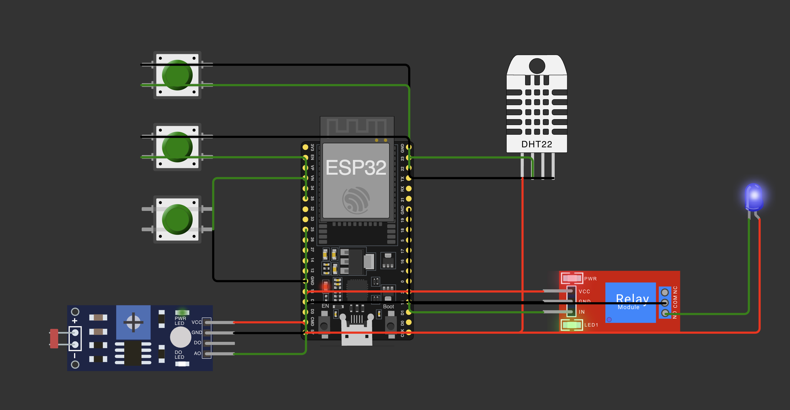

# FIAP - Faculdade de Informática e Administração Paulista

<p align="center">
<a href= "https://www.fiap.com.br/"></a>
</p>

<br>

# Cap 1 - Um Mapa do Tesouro

## Grupo 98

## 👨‍🎓 Integrantes: 
- <a href="https://www.linkedin.com/in/bruno-thomasi-4853ab58/">Bruno de Moraes Thomasi - RM567919</a>
- <a href="https://www.linkedin.com/in/hugo-camposs98/">Hugo da Silva Campos - RM567421</a>


## 📜 Descrição

**Sistema de Monitoramento Agrícola Inteligente para Cultivo de Café com ESP32.**

O projeto monitora automaticamente os níveis de NPK (Nitrogênio, Fósforo, Potássio) no solo através de sensores digitais, mede pH utilizando sensor LDR com conversão luminosidade-acidez, e controla umidade do solo via sensor DHT22. 

Quando detecta solo seco (<45%), aciona automaticamente bomba de irrigação por relé. 

Fornece diagnósticos específicos para café com proporções ideais de adubação (4-14-8) e recomendações precisas baseadas nas deficiências nutricionais detectadas.

## Vídeo demonstrativo no YouTube:

[](https://youtu.be/swBj-vuOuaY)

<p><i><a href="https://youtu.be/swBj-vuOuaY" target="_blank">Link: https://youtu.be/swBj-vuOuaY</a></i></p>

## Link de acesso no GitHub:

<a href="https://github.com/brunothomasi/curso-ia-fiap/tree/main/atividade-fase-2/cap-1" target="_blank">Clique aqui para acessar a pasta no Repositório no GitHub</a>

## Circuito:

<p align="center"></p>

<a href="https://wokwi.com/projects/444843986534022145" target="_blank">Abrir o Projeto no Wokwi para testes</a>

## 📁 Estrutura de pastas

Dentre os arquivos e pastas presentes na raiz do projeto, definem-se:
- **raíz**: Encontra-se scripts para configuração do ambiente
- **src**: Scripts para usar o programa no Wokwi ou subir no seu ESP32
- **.pio, .vscode, assets**: pasta para uso interno sem relação direta com o código do projeto.

## 🔧 Como executar o código

**É necessário ter uma conta no Wokwi.com.**

1. No seu Wokwi.com crie um projeto e copie o conteúdo do arquivo "src/prog.ino" e cole no espaço para código à direita na aba "sketch.ino"
2. No seu Wokwi.com clique na aba "diagram.json" e copie e cole o conteúdo do arquivo "src/diagram.json".
3. Clique no botão Play.
4. Você irá monitorar o funcionamento do programa nos logs Serial da área branca na parte inferior da tela.
5. Clique no DHT22 e modifique a umidade, para abaixo de 40% para ligar o relé, entre 40 e 60 está na condição ideal, acima de 60% estaria encharcado o solo e nessas duas situções desligará o relé. O relé está ligando uma luz azul que representa a bomba de água que seria ligada. **Estamos usando apenas a umidade do solo como parâmetro para irrigação, o NPK e PH são detalhados no Serial Monitor e poderiam futuramente aparecer em um display ou outra forma de alerta, ou liberação automática.**
6. Clique nos botões de Seleção NPK mantendo pressionada a tecla CTRL (no Mac CMD) para ativá-los ou desativá-los. Conforme for modificando os valores o sistema informará no Serial Monitor o que está faltando e qual ação deve ser tomada na adubação.
7. Clique no Fotoresistor (LDR) para modificar os valores de LUX entre abaixo de 1000, entre 1000 e 1300, entre 1300 e 2000 e acima de 2000, modificando entre esses valores irá modificar o PH, já que esse sensor simularia o sensor de PH. O sistema informará no Serial Monitor a situação atual.

## ⚙️ Lógica de Funcionamento

### 🧪 1. Algoritmo de Medição de pH via LDR

O sistema captura a luminosidade converte em lux e aplica uma escala para **definir o PH simulado** a partir do sensor LDR:

```cpp
int verificaPH()
```

### 🌱 2. Sistema Inteligente de NPK para Café

O algoritmo implementa **lógica combinatória** baseada nas necessidades específicas do café:

```cpp
int verificaNPK()
```

### 💧 3. Sistema de Irrigação Inteligente

```cpp
void verificaUmidade() 
```

### 🔄 4. Loop Principal para Execução do Sistema

Executa o programa chamando as funções acima com intervalo de 2 segundos entre cada execução.

```cpp
void loop()
```

### 5. Liga ou Desliga o Relé

Função que liga ou desliga o relé que aciona a bomba dágua, no caso representado por um led azul.

```cpp
void setRele()
```

### 📺 Interface Serial Monitor

O sistema fornece **logging detalhado** via Serial Monitor:
```
Iniciando sensores...
Nitrogenio: Adequado
Fosforo: Baixo  
Potassio: Adequado
P Baixo, adubar imediatamente na proporção 3-14-6
pH do solo estimado a partir do sensor de NPK: 5.5
Valor Lux Analog: 1250.34
pH do solo estimado a partir do sensor LDR: 6
pH do solo LDR atualizado: 6
Umidade: 38.20 - Solo Seco
Ativando a bomba de irrigação  
Bomba de irrigação ligada.
```

### ❓ Problemas Encontrados

- O comando ```analogWrite``` para o LDR não funciona no simulador, provavelmente por conta do ambiente do Wokwi, que já possui um seletor de LUX, portanto não está sendo possível reescrevê-lo.
- Os botões mesmo usando Control por vezes oferecem erros de leitura do status, ficando como marcado quando estão desmarcados. Pesquisei e pode ser por conta do Bounce, testei das duas formas selecionado ou desmarcado e mesmo assim não funcionou bem. Particularmente nesse caso específico eu iria sugerir o uso de chave seletora (switch) para melhor assertividade.

### 🔌 Mapeamento de Pinos

| Componente   | Pino ESP32 | Função                         | Tipo              |
|--------------|------------|--------------------------------|-------------------|
| **DHT22**    | GPIO 23    | Sensor de Umidade/Temperatura  | Digital           |
| **Botão N**  | GPIO 22    | Sensor NPK - Nitrogênio        | Digital (Pull-up) |
| **Botão P**  | GPIO 34    | Sensor NPK - Fósforo           | Digital (Pull-up) |
| **Botão K**  | GPIO 35    | Sensor NPK - Potássio          | Digital (Pull-up) |
| **LDR**      | GPIO 25    | Sensor de pH (simulado)        | Analógico         |
| **Relé**     | GPIO 15    | Controle da Bomba de Irrigação | Digital Output    |

## 🔧 Componentes de Hardware Utilizados

### 1. **ESP32 DevKit C V4**
- **Microcontrolador principal** com WiFi/Bluetooth integrado
- **32 pinos GPIO** com conversores ADC de 12 bits
- **Frequência**: 240 MHz (dual-core)
- **Memória**: 520 KB SRAM

### 2. **Sensor DHT22 (AM2302)**
- **Medição**: Umidade (0-100%) e Temperatura (-40°C a 80°C)
- **Precisão**: ±2% RH, ±0.5°C
- **Interface**: Protocolo de comunicação digital proprietário
- **Aplicação**: Monitoramento da umidade do solo para controle de irrigação

### 3. **Fotoresistor (LDR) - Simulação de pH**
- **Resistência**: Varia de 200Ω (luz intensa) a 20MΩ (escuridão)
- **Conversão**: Luminosidade → pH através de algoritmo matemático
- **Faixa simulada**: pH 0-9
- **Calibração**: Baseada em constantes GAMMA (0.7) e RL10 (50)

### 4. **Botões NPK (Pull-up)**
- **Configuração**: INPUT_PULLUP (resistor interno de 47kΩ)
- **Lógica**: HIGH = Nutriente adequado, LOW = Nutriente deficiente
- **Simulação**: Sensores digitais de NPK reais
- **Debounce**: Implementado via hardware (bounce = 0)

### 5. **Módulo Relé + LED Indicador**
- **Tensão**: 5V DC
- **Corrente**: Até 10A (para bomba de irrigação real)
- **Isolamento**: Ótico (segurança elétrica)
- **Indicador**: LED azul representa bomba de água ativa

## 📚 Referências Técnicas

1. **ESP32 Technical Reference Manual** - Espressif Systems
2. **DHT22 Datasheet** - Aosong Electronics  
3. **Agricultura de Precisão** - Embrapa Instrumentação
4. **Nutrição Mineral do Cafeeiro** - Instituto Agronômico de Campinas
5. **IoT in Agriculture** - IEEE Sensors Journal
6. **Soil pH Management** - International Coffee Organization

## 🗃 Histórico de lançamentos

* 1.0.0 - 15/10/2025

## 📋 Licença

<p xmlns:cc="http://creativecommons.org/ns#" xmlns:dct="http://purl.org/dc/terms/"><a property="dct:title" rel="cc:attributionURL" href="https://github.com/agodoi/template">MODELO GIT FIAP</a> por <a rel="cc:attributionURL dct:creator" property="cc:attributionName" href="https://fiap.com.br">Fiap</a> está licenciado sobre <a href="http://creativecommons.org/licenses/by/4.0/?ref=chooser-v1" target="_blank" rel="license noopener noreferrer" style="display:inline-block;">Attribution 4.0 International</a>.</p>