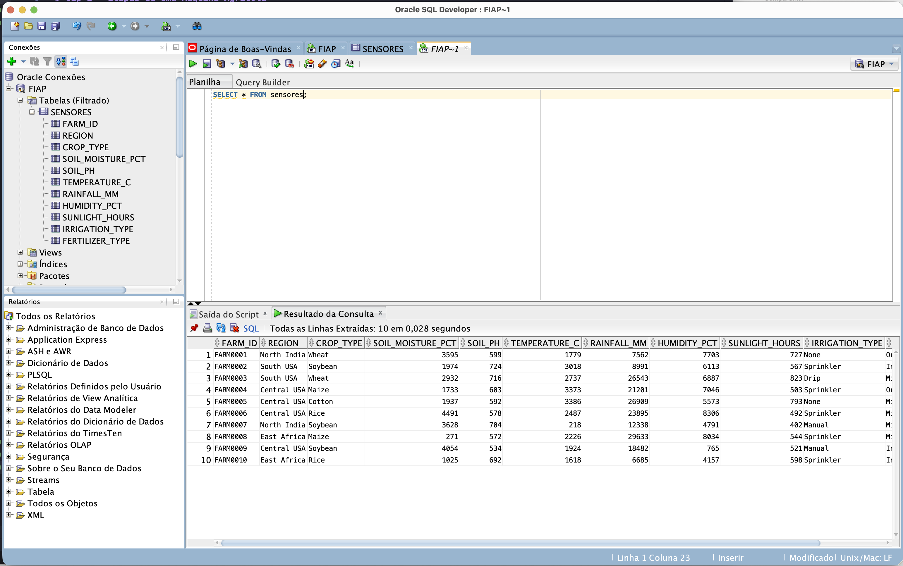
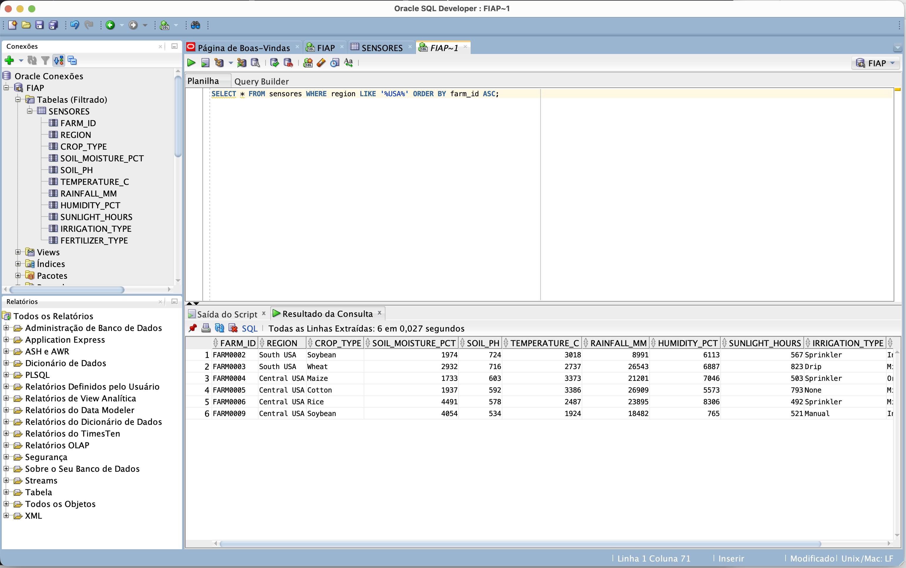
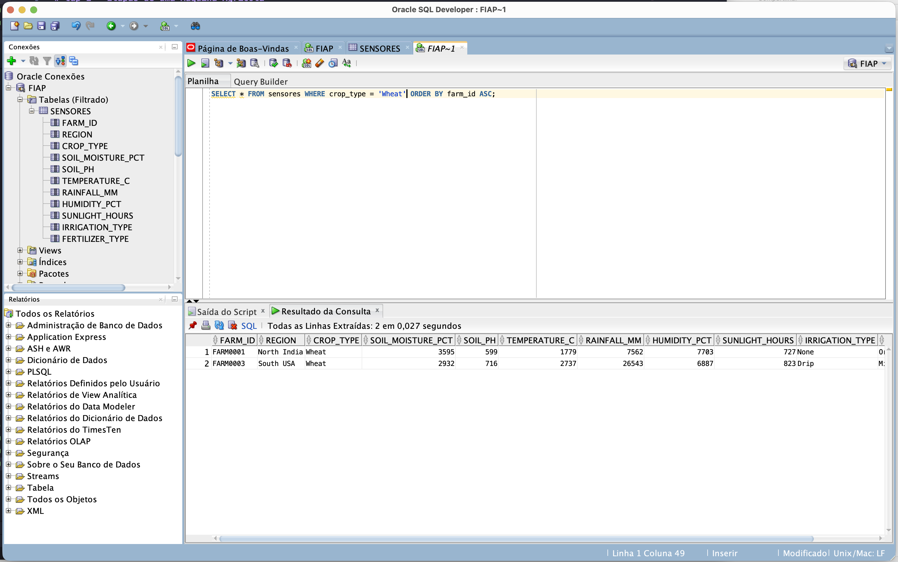
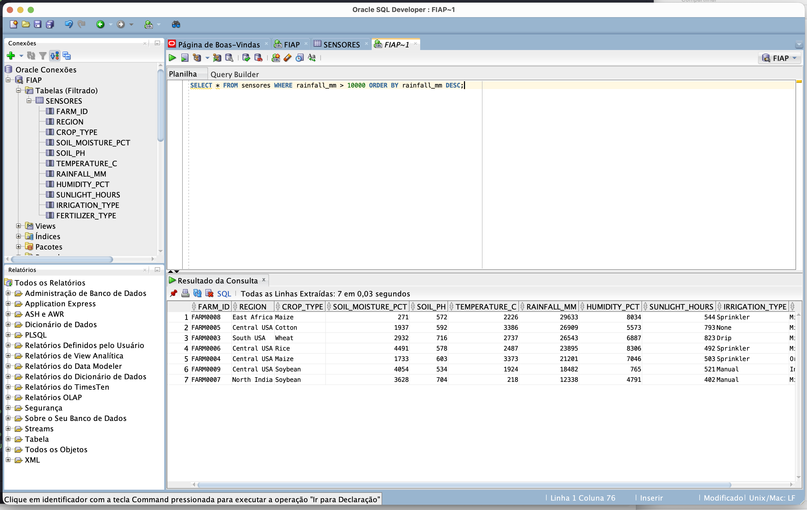
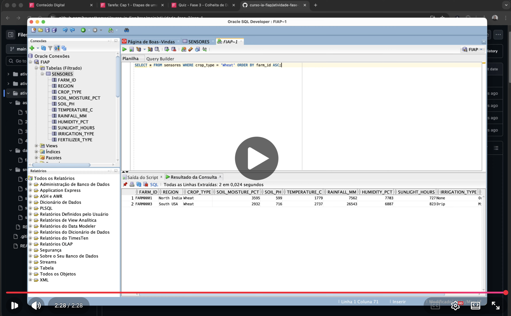

# FIAP - Faculdade de Informática e Administração Paulista

 

# Cap 1 - Etapas de uma Máquina Agrícola

## Grupo 47

## 👨‍🎓 Integrantes: 
- <a href="https://www.linkedin.com/in/bruno-thomasi-4853ab58/">Bruno de Moraes Thomasi - RM567919</a>
- <a href="https://www.linkedin.com/in/hugo-camposs98/">Hugo da Silva Campos - RM567421</a>

## Link de acesso no GitHub:

<a href="https://github.com/brunothomasi/curso-ia-fiap/tree/main/atividade-fase-3/cap-1">Clique aqui para acessar a pasta no Repositório no GitHub</a>

## 📜 Descrição

Esse projeto explica o uso do Oracle SQL Database e demonstra dados importados e consultas realizadas no mesmo.

## 📁 Estrutura de pastas

Dentre os arquivos e pastas presentes na raiz do projeto, definem-se:

- **/src/**: Scripts SQL contendo consultas realizadas.
- **/data/farm_data.csv**: Dados utilizados para importação.
- **/assets/**: Arquivos de imagens para uso no Readme.

## Telas de Demonstração do Oracle

A Estrutura da tabela criada encontra-se disponível em <a href="./src/create-table.sql">/src/create-table.sql</a>

### Consultas de demonstração realizadas

#### Todos Registros:

*Print de tela contendo dados importados em um SELECT sem filtragem.*

A Consulta acima encontra-se disponível em <a href="./src/search-unfiltered.sql">/src/search-unfiltered.sql</a>

#### Busca por Região

*Print de tela contendo busca por uma região que contenha "USA" no nome.*

A Consulta acima encontra-se disponível em <a href="./src/search-region.sql">/src/search-region.sql</a>

#### Busca por Cultura

*Print de tela contendo busca por uma cultura específica "Wheat".*

A Consulta acima encontra-se disponível em <a href="./src/search-crop_type.sql">/src/search-crop_type.sql</a>

#### Busca por Quantidade de Chuva

*Print de tela contendo busca por registros que tenham tido chuva acima 10000.*

A Consulta acima encontra-se disponível em <a href="./src/search-rainfall_mm.sql">/src/search-rainfall_mm.sql</a>

## Demonstração Estrutura em Vídeo:

[Clique para abrir o Vídeo no YouTube - https://youtu.be/6URtr6Ls9uc](https://youtu.be/6URtr6Ls9uc)

## 🗃 Histórico de lançamentos

* 0.1.0 - 12/11/2025

## 📋 Licença

<a property="dct:title" rel="cc:attributionURL" href="https://github.com/agodoi/template">MODELO GIT FIAP</a> por <a rel="cc:attributionURL dct:creator" property="cc:attributionName" href="https://fiap.com.br">Fiap</a> está licenciado sobre <a href="http://creativecommons.org/licenses/by/4.0/?ref=chooser-v1" target="_blank" rel="license noopener noreferrer" style="display:inline-block;">Attribution 4.0 International</a>.
